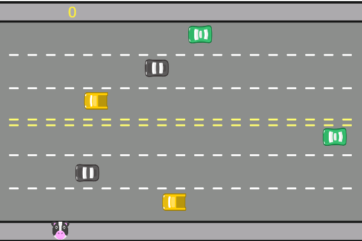

<h1 align=center>Jogo "Atravesse a rua" 🐮</h1>

Descrição: Jogo utiluzando javascript para que o animal atravesse a rua e chegue ao outro lado em segurança. Caso chegue sem colidir com nenhum carro, o ponto é marcado. 
Caso haja a colisão, o jogo se inicia novamente do ponto de partida e você perde 1 ponto. 

Utilize para se divertir e treinar. 

Este foi um desafio da aula de Javascript da #Alura. 
